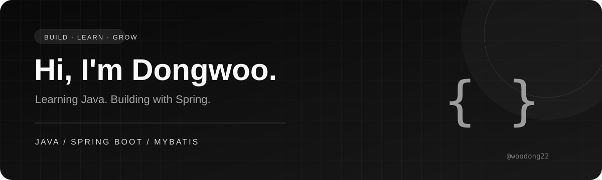

  

  ### 안녕하세요, 김동우입니다
  Java와 Spring으로 배우고 만드는 과정을 기록합니다.

  

 

## About me

Java 기초부터 알고리즘 문제 풀이, Spring 기반 웹 애플리케이션까지 학습 내용을 코드로 쌓아가고 있습니다.

- **Java** — 문법과 기본 개념을 예제 코드로 연습합니다.
- **Problem solving** — 프로그래머스 문제를 Java로 풀며 풀이를 기록합니다.
- **Backend** — Spring Boot와 MyBatis를 활용한 웹 기능을 구현합니다.
- **API integration** — OCR·NLP와 외부 API를 활용하는 코드를 공부합니다.

## Working with

  
  
  
  

## Projects & learning

| Repository | 기록하고 있는 내용 |
| :--- | :--- |
| [**SpringBootMyBatis**](https://github.com/woodong22/SpringBootMyBatis) | Spring Boot·MyBatis 기반 웹 개발. 게시판, 사용자, 채팅과 외부 API 연동 기능을 담고 있습니다. |
| [**SpringAiBasic**](https://github.com/woodong22/SpringAiBasic) | Spring 기반 OCR·NLP 기능과 MyBatis 데이터 처리 예제를 학습합니다. |
| [**programmers**](https://github.com/woodong22/programmers) | Java로 풀어가는 프로그래머스 알고리즘 문제 풀이 기록입니다. |
| [**myJava**](https://github.com/woodong22/myJava) | Java 기본 문법과 개념을 익히기 위한 예제 코드를 모았습니다. |

 

  배운 것을 코드로 남기고, 작은 구현을 차곡차곡 쌓아갑니다.

